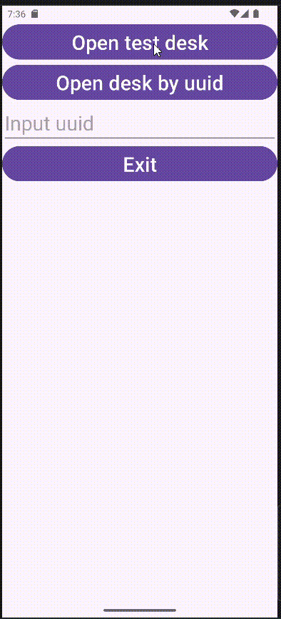
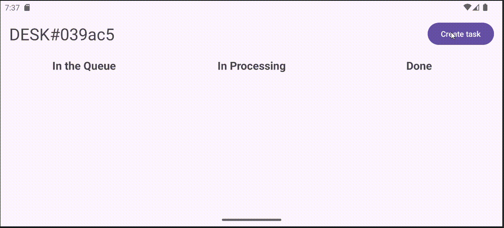

# KanbanDesk

Android-приложение для управления задачами в стиле Kanban-доски.

## Возможности

- Создание задач с заголовком и описанием
- Три колонки для организации рабочего процесса
- Drag-and-drop перенос задач между колонками (долгое нажатие)
- Перемещение задач внутри одной колонки

## Технологии

- **Kotlin** + **Java** (смешанный проект)
- **RecyclerView** с кастомным адаптером
- **Drag-and-drop API** (Android)
- **Fragment API**

## Структура проекта

```
app/src/main/java/org/top/kanbanchallenge/
├── MainActivity.java              # Главная активность
├── DeskFragment.java              # Фрагмент Kanban-доски
└── thingsForRecyclerView/
    ├── CustomAdapter.kt           # Адаптер для RecyclerView
    ├── TaskItem.kt                # Модель задачи
    └── setupDropTarget.kt         # Логика drag-and-drop
```

## Сборка

```bash
./gradlew assembleDebug
```

## Установка

Откройте проект в Android Studio и запустите на эмуляторе или устройстве.

## Демонстрация работы




